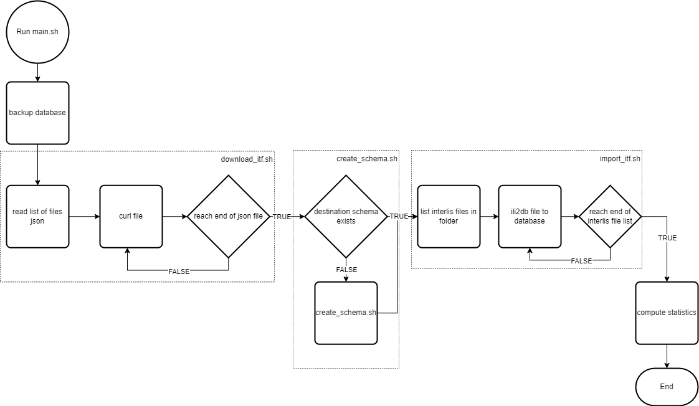

# import-interlis-mensuration-officielle

Un projet permettant de télécharger des fichiers interlis, créer un schéma dans une base de données, importer les données.

## Objectifs

Le but est d'automatiser l'import des données cantonales localement, en limitant le nombre de scripts et d'outils utilisés. Conserver la structure du modèle MD.01-MO-CH est également voulu pour pouvoir dénormaliser et garder le contrôle au sein de la base de données, et non lors de processsus d'import ou d'export.

## Outils

Il s'agit essentiellement de scripts batch/shell. Les opérations demandent de télécharger, manipuler des fichiers et de communiquer avec une base de données. Le coeur des opérations se fait grâce à [ili2db](https://github.com/claeis/ili2db) qui est la seule librairie externe utilisée ici.

## Fonctionnement

Trois opérations peuvent être réalisées indépendamment ou enchaînées:
1. Télécharger les fichiers interlis sur le site de l'Asit-VD.
2. Créer le schéma et la structure du modèle dans la base de données, sur la base d'un fichier .ili.
3. Importer les fichiers interlis se trouvant dans un dossier renseigné.

Ces trois scripts se touvent dans le dossier /src. Ils peuvent être enchaînés en lançant le script main.sh à la racine du projet.
Un script se lance par la ligne de commande selon l'exemple qui suit:

```sh
main.sh 
```

ou 

```sh
create_schema.sh [options]
```

L'enchaînement des opérations à travers ```main.sh``` est illustré dans le diagramme de flux suivant.

<figure>

<a name="figure-1"></a><figcaption>Figure 1 - Diagramme de flux de l'outil</figcaption>
</figure>


## Paramétrage

Chaque script peut être lancé individuellement en respectant les paramètres nécessaires au fonctionnement. Ces mêmes scripts peuvent être enchaînés en lançant le script ```main.sh```. Ce dernier est paramétré grâce à un fichier .env. Le fichier [.envexample](.envexample) indique les variables d'environnement à définir pour le bon fonctionnement du script.

## Scripts

Les scripts sont succintement décrits ci-dessous.

### download_itf.sh

Ce script permet de télécharger les fichiers interlis se trouvant sur le site de l'AVRIC (viageo.ch/api/download/..., option ```-l```), en utilisant une _basic authentication_ (```-a```). La liste des fichiers à télécharger est sous la forme d'un fichier json construit comme suit:

```json
{
    "5402": 2,
    "5406": 6,
    "5409": 9,
    ...
}
```

Chaque clé est un numéro de commune fédéral (OFS), chaque valeur son numéro de commune cantonal équivalent. Le chemin vers la fichier json est à renseigner pour l'option ```-c```. Les fichier sont téléchargés dans le dossier passé à l'option ```-f```.

L'appel du script peut ressembler à 

```sh
src/download_itf.sh -l "viageo.ch/api/download/my_link" -a "basic my_auth" -c "/home/my_role/communes.json" -f "/tmp/my_download_directory/"
```

### create_schema.sh

Ce script permet de créer le schéma dans lequel seront importées les données. L'essentiel des options du script sont utilisées pour le passage des information de connexion à la base de données: ```[-U USER]```, ```[-H HOST]```, ```[-p PORT]```, ```[-s SCHEMA]```, ```[-d DATABASE]```, ```[-w PASSWORD]```. Un pg_service n'est pas utilisé car ili2db ne permet pas leur utilisation au moment d'écrire ce texte. 

Les options restantes permettent de paramétrer la création du schéma:
* ```-E```/```--createEnumTabs``` --> Crée une table avec les différentes valeurs d'énumération pour chaque définition d'énumération.
* ```-T```/```--createTidCol``` --> Crée une colonne supplémentaire _t_ili_tid_ dans chaque table.
* ```-B```/```--createBasketCol``` --> Crée dans chaque table une colonne supplémentaire _t_basket_ pour pouvoir identifier le conteneur.
* ```-n t_id``` --> Le nom de la colonne d'identifiant unique utilisé dans le schéma.
* ```-m interlis_model``` --> Le chemin vers le model interlis (.ili) à construire.

Un exemple d'appel du script ci-dessous:

```sh
src/create_schema.sh -d my_db -h my_host -p 5432 -s my_schema -U username -w password -E -T -B -n "fid" -m "/path/to/my/model.ili"
```

### drop_schema.sh

Le script antagoniste à ```create_schema.sh```. Il permet de supprimer un schéma dans une base de données. Ici un pg_service est utilisé pour stocker les informations de connexion. Pas franchement plus rapide que ```psql service=my_service -c 'DROP my_schema CASCADE;'```

### import_itf.sh

Ce script réalise l'essentiel du travail, et la très large majorité du temps de traitement lui incombe. Il parcourt un dossier contenant une liste de fichiers interlis et importe chacun dans la base de données correspondant aux informations de connexion données. La création préalable d'un schéma avec la structure de modèle adapatée aux données importées est obligatoire.

Comme dans le cas du script ```create_schema.sh```, une bonne partie des options récupèrent les informations de connexion: ```[-U USER]```, ```[-H HOST]```, ```[-p PORT]```, ```[-s SCHEMA]```, ```[-d DATABASE]```, ```[-w PASSWORD]```.

Le chemin vers le dossier contenant les fichiers interlis (potentiellement le même que celui de téléchargement) est donné par le paramètre ```-f source folder```. Le paramètre ```-n tid_name``` indique le nom de la colonne _t_id_ utilisé lors de la création du schéma.

Si l'on considère le dossier de téléchargement utilisé dans l'exemple de ```download_itf.sh```, un appel de ```import_itf.sh``` pourrait ressembler à:

```sh
src/import_itf.sh -d my_db -h my_host -p 5432 -s my_schema -U username -w password -f "/tmp/my_download_directory/" -n "fid"
```

### main.sh

Le script privilégié pour intéragir avec cet ensemble. Il permet d'appeler les différents scripts et de centraliser les variables. Il utilise un ficher ```.env``` pour la lecture des variables et ainsi éviter d'exposer certaines valeurs. 

Les variables d'environnement lues sont les suivantes:
* ```MOVD_DOWNLOAD_LINK``` --> URL de téléchargement des fichiers interlis MO
* ```NPCSVD_DOWNLOAD_LINK``` --> URL de téléchargement des fichiers interlis NPCS
* ```AUTHORIZATION``` --> Authentification à l'api de téléchargement
* ```DATABASE``` --> le nom de la base de données hébergeant l'import
* ```HOST``` --> le hos de la base de données
* ```USER``` --> _username_ pour le traitement dans la base de données
* ```PASSWORD``` --> le mot de passe pour la connexion à la base de données
* ```PORT``` --> le port de connexion à la base de données
* ```MOVD_SCHEMA``` --> le nom du schéma recevant les données MO
* ```NPCSVD_SCHEMA``` --> le nom du schéma recevant les données NPCS
* ```T_ID_NAME``` --> le nom de la colonne t_id (identifiant système dans la base de données)

## Réflexions et perspectives

La motivation initiale pour ce travail était de réduire la complexité des flux de données et de centraliser certaines opérations. Il s'agissait également de désemcombrer et décorréler certaines étapes. Dans une certaine mesure cet outil y parvient:
* l'import de données interlis a désormais son programme dédié, celui-ci est totalement autonome, son exécution est indépendante de tout autre script.
* le temps de traitement des données de MO (et même en incluant l'export en shapefile) a été considérablement réduit; de plusieurs jours pour l'ancien traitement (5 pour le téléchargement + import interlis lors de la dernière exécution) celui-ci a été ramené à 1h45 en moyenne, soit 70x plus rapide, ou une amélioration de la performance d'environ 7000%.
* la MO est stockée dans son modèle de données officielle, plus normalisé que l'ancienne version du traitement, ce qui facilite la manipulation, la communication et le rapprochement avec les informations du canton. La documentation du modèle de données cantonale est complètement applicable.
* l'ensemble est totalement opensource (mais ne pas oublier le travail réalisé sur [**ili2db**](https://github.com/claeis/ili2db)).
 
L'ensemble de la MO d'intérêt (le canton de Vaud) est désormais téléchargeable chaque semaine, contre une fois tous les 4-5-6 mois auparavant. De plus, elle est désormais stockée en utilisant son modèle de données officielle, ce qui rend sa manipulation bien plus flexible. Le traitement peut être également planifié à l'aide d'un simple ```cron``` job, alors qu'une action manuelle était nécessaire auparavant.

Dans son état actuel, le script ````main.sh``` travail explicitement sur des données MO et des données NPCS, rendant son design assez simpliste avec des répétitions d'opérations, ainsi que des traitements très liés au processus en place, et impossible à utiliser dans un autre contexte. Le type d'opérations réalisées restant simple cela ne pose pas de problème majeur pour l'instant, mais un effort de refactorisation sera le bienvenu. Les scripts qui le composent peuvent cependant être utilisés indépendamment, ce qui fut le cas au moment de l'ajout des données de NPCS.

Assez peu de contrôle ou alerte existent, tous les output des scripts peuvent être loggés, et l'exécution de ```main.sh``` se termine par la définition d'un code erreur en fonction du contenu du log d'erreur, ce qui est peu élégant. Un système d'alerte pourrait être ajouté.
